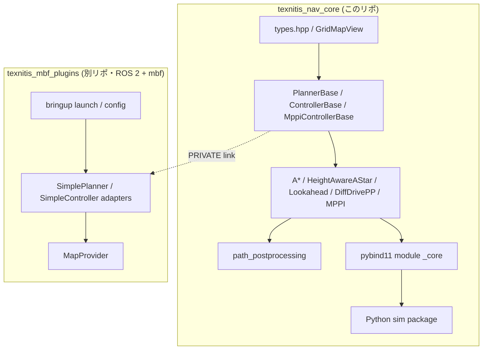

# アーキテクチャ概観

## レイヤ

## 依存方向

- `texnitis_nav_core` は **rclcpp / nav_msgs / geometry_msgs / pluginlib に一切依存しない**
- 外部ヘビー依存は Eigen3（必須）と CasADi（`NAV_CORE_WITH_MPPI=ON` のときのみ）
- pybind11 は `NAV_CORE_BUILD_PYTHON=ON` のときのみ
- 下流（`texnitis_mbf_plugins`）はこのコアを **PRIVATE link**。ROS 依存型はアダプタ層に閉じ込める

## ディレクトリの責務

| ディレクトリ | 責務 |
|---|---|
| `include/texnitis_nav_core/` | 公開ヘッダ。POD 型 (`Pose2D`, `Twist2D`, `Path2D`) と純粋仮想インターフェース |
| `src/` | 実装本体 |
| `bindings/python/` | pybind11 で `_core` モジュールを生成 |
| `python/texnitis_nav_core/` | Python パッケージ。`sim/` 配下に純 Python の 2D シミュレータ |
| `tests/` | GoogleTest 単体・シナリオテスト |
| `tests_python/` | pytest（バインディングとシミュレータ） |
| `scenarios/` | シナリオ YAML（C++ と Python の両方から読まれる） |
| `examples/` | C++ / Python のデモコード |

## このページの位置付け

- **全体像** はここで。
- **なぜこの分け方なのか** は [design_rationale.md](design_rationale.md)。
- **ソースの読む順序** は [reading_guide.md](reading_guide.md)。
