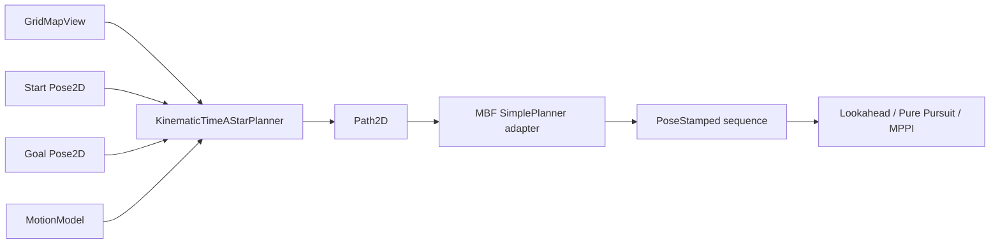
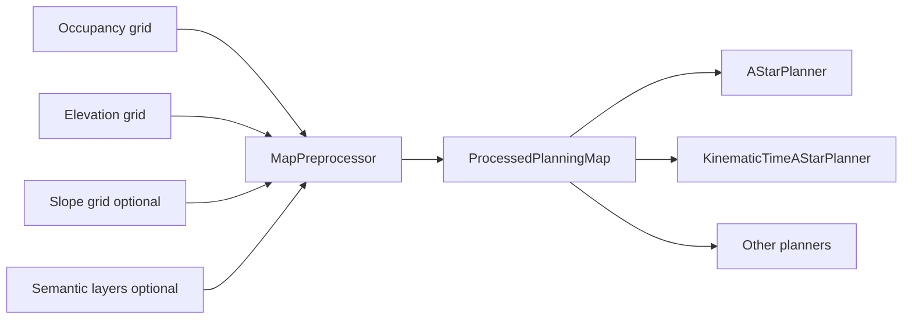

# Kinematic Time Planner 設計書

## 1. 目的

`KinematicTimeAStarPlanner`（仮称）は、幾何学的な最短距離ではなく、
**対象機体が静的地図上を走り切る推定時間**を最小化するグローバル
プランナーである。

既存の `AStarPlanner` は `(x, y)` の 4/8 近傍探索であり、機体姿勢、
横移動の可否、方向別速度、旋回時間を扱わない。新プランナーは探索状態を
`(x, y, yaw)` に拡張し、移動機構ごとの Motion Primitive と時間コストを
使用する。

初期リリースでは、次の二つの運動モデルを対象とする。

- `HolonomicMotionModel`: 4 輪オムニ、メカナムなど
- `DifferentialDriveMotionModel`: 差動二輪

独立ステアリングと Ackermann は、共通インターフェースを使う後続モデルとする。

## 2. スコープ

### 2.1 初期リリースで実現すること

- 占有グリッドとロボット外形を考慮した静的障害物回避
- 開始・終了 yaw を含む SE(2) 探索
- 移動機構ごとに実現可能な Motion Primitive のみを展開
- 方向別の速度、角速度、加速度を用いた遷移時間の推定
- 推定走行時間を主目的とした A* 探索
- `Path2D` を返す既存 `PlannerBase` と MBF `SimplePlanner` との互換性
- 同じ入力に対して決定的な結果を返すこと
- `cancel()`、`reset()`、`LoggerFn` の既存規約を守ること

### 2.2 初期リリースでは実現しないこと

- 動的障害物の時空間計画
- 車輪スリップや路面摩擦のオンライン推定
- Planner が指定した速度を MBF 標準 Path 経由で Controller へ渡すこと
- 厳密な連続時間最適制御
- 独立ステアリングの各輪舵角を探索状態に含めること

初期版の「最速」は、静的地図と設定された機体制約に対する
**離散 Motion Primitive 上の最小推定時間**を意味する。

## 3. 既存コンポーネントとの関係



アルゴリズムは `Nyanziba_nav_core` に置き、ROS パラメータ取得、型変換、
pluginlib 登録だけを `Nyanziba_mbf_plugins` に置く。既存の依存方向は変えない。

旧来の高さしきい値によるlethal化は探索固有ではなく、すべてのPlannerが同じ安全判定を
使うための前処理である。この責務は共通`MapPreprocessor`へ移し、旧専用Plannerは削除した。

ただし、傾斜方向による速度差、転倒限界、エネルギー消費などを探索中に評価する
Plannerは別である。これはセルを一律 lethal/cost に変換するだけでは表現できないため、
将来 `TerrainAwarePlanner` として運動モデルと地形レイヤを同時に評価する。

## 3.1 共通 Map Preprocessor



`MapPreprocessor` の責務は次とする。

- occupancy の unknown/lethal 判定を正規化する
- elevation の局所差分から段差と傾斜を求める
- 入力済み slope grid がある場合は、その値を検証して利用する
- `max_step_height`、`max_slope` を超えるセルを lethal にする
- 閾値未満の地形を scalar traversal cost に変換する
- inflationまたはfootprint clearanceを一度だけ計算する
- 入力レイヤの解像度・原点・範囲が異なる場合にworld座標で対応付ける
- 欠損レイヤに対する fail/fallback 方針を適用する

OccupancyGridだけを持つ通常の2D Mapを最小入力として正式にサポートする。
elevationとslopeは任意レイヤであり、未指定なら地形判定を無効化する。したがって、
既存のmap_serverが配信する `/map` だけでもPlannerを使用できる。

| 入力 | 動作 |
|---|---|
| occupancyのみ | lethal/unknown判定とinflationを実行。地形コストは0 |
| occupancy + elevation | elevationから段差・傾斜を算出して統合 |
| occupancy + slope | 提供された傾斜を検証して統合 |
| occupancy + elevation + slope | 両方を統合。矛盾時の優先規則を設定で選択 |

2D Mapモードは特殊なPlannerを使わず、同じ前処理パイプラインのレイヤ省略として扱う。
これによりAStar、KinematicTimeAStar、将来のPlannerでマップ読込経路が分岐しない。

出力は所有権を持つコンテナと、そのzero-copy viewに分ける。

```cpp
struct ProcessedPlanningMap {
    GridMapView occupancy;
    const float *traversal_cost{nullptr};
    const float *elevation_m{nullptr};
    const float *slope_rad{nullptr};
    int width{0};
    int height{0};
};

class MapPreprocessor {
   public:
    [[nodiscard]] PreprocessResult process(
        const GridMapView &occupancy,
        const TerrainLayersView &terrain,
        ProcessedPlanningMapStorage &output) const;
};
```

任意レイヤの有無はnull pointerだけでなく明示フラグで表し、設定ミスと意図的な
2D Map運用を区別する。

```cpp
struct TerrainLayersView {
    std::optional<ElevationGridView> elevation;
    std::optional<SlopeGridView> slope;
};

enum class MissingTerrainPolicy {
    Allow2DOnly,  // 任意レイヤがなくても正常処理
    RequireElevation,
    RequireSlope,
    RequireAll,
};
```

既定値は `Allow2DOnly` とする。必須設定したレイヤが未到着の場合だけ
`NotInitialized` を返す。

`ProcessedPlanningMapStorage` が各配列を所有し、`ProcessedPlanningMap` は
`planPath()` 中だけ借用する。生ポインタの寿命をPlannerに持ち越さない。

旧形式の`int8_t [0, 100]`任意単位は廃止した。現在の内部単位はelevation `[m]`、
slopeは`dz/dx`, `dz/dy`（無次元rise/run）である。

### 3.2 前処理とTerrain-aware探索の境界

共通前処理へ置く判定:

- どの方向から進入しても越えられない段差
- 機体限界を超える絶対傾斜
- 全Plannerで共通の障害物膨張
- 方向によらない路面コスト

PlannerまたはMotion Modelへ残す判定:

- 上りと下りで異なる最高速度・加速度
- 横傾斜と進行方向の組み合わせによる転倒余裕
- 経路方向によって変わる消費エネルギー
- 姿勢、車輪配置、接地点によって変わる走破可能性

後者が必要なときだけ、`ProcessedPlanningMap` の elevation/slope layerを
`MotionModel::estimateTransition()` が参照する。この責務は
`KinematicTimeAStarPlanner`の方向依存Terrain評価として実装する。

## 4. 公開 API

### 4.1 Motion Model

Motion Model は探索器から運動学固有処理を分離する。

```cpp
struct LatticeState {
    int mx{0};
    int my{0};
    int yaw_bin{0};
};

struct MotionPrimitive {
    int delta_x{0};
    int delta_y{0};
    int delta_yaw_bins{0};

    // Primitive 内の衝突判定用サンプル。始点基準、メートル・ラジアン。
    std::vector<Pose2D> samples;

    double arc_length{0.0};
    double delta_yaw{0.0};
    bool reverse{false};
};

struct TransitionEstimate {
    bool feasible{false};
    double duration{0.0};
    double penalty{0.0};
};

class MotionModel {
   public:
    virtual ~MotionModel() = default;

    [[nodiscard]] virtual std::span<const MotionPrimitive>
    primitivesFor(const LatticeState &state) const = 0;

    [[nodiscard]] virtual TransitionEstimate estimateTransition(
        const LatticeState &from,
        const MotionPrimitive &primitive,
        double map_resolution) const = 0;

    [[nodiscard]] virtual double lowerBoundTime(
        const Pose2D &from,
        const Pose2D &goal) const = 0;
};
```

実装では `std::span` が参照する Primitive 集合をモデル内に事前生成し、探索中の
ヒープ確保を避ける。モデルは構築後 immutable とし、一つの `planPath()` 中に
設定を変更しない。

### 4.2 Planner

```cpp
class KinematicTimeAStarPlanner final : public PlannerBase {
   public:
    KinematicTimeAStarPlanner(
        KinematicTimeAStarParams params,
        std::shared_ptr<const MotionModel> motion_model);

    [[nodiscard]] PlanResult planPath(
        const GridMapView &map,
        const Pose2D &start,
        const Pose2D &goal,
        Path2D &out_path) override;

    void cancel() noexcept override;
    void reset() override;
};
```

`PlannerBase` と `Path2D` は初期リリースでは変更しない。Python binding と既存
MBF adapterへの破壊的変更を避けるためである。

## 5. 運動モデル

### 5.1 HolonomicMotionModel

状態姿勢に対して、機体座標系の並進と旋回を組み合わせた Primitive を生成する。

初期 Primitive 集合:

- 前、後、左、右
- 前後左右を組み合わせた斜行
- 左右のその場回転
- 並進しながら左右へ回転

メカナムの場合、機体速度 `(vx, vy, wz)` を既存 `MecanumKinematics` で車輪速度へ
変換し、いずれかの車輪上限を超える Primitive は速度を縮小する。単純なオムニ
モデルでは方向別の `max_velocity_x/y` を楕円制約として扱う。

並進と旋回を同時実行できる場合の下限時間は次とする。

```text
t_translation = distance / feasible_linear_speed
t_rotation    = abs(delta_yaw) / max_angular_velocity
t_cruise      = max(t_translation, t_rotation)
```

加減速時間を含む実時間推定には、距離ごとの三角・台形速度プロファイルを使う。

### 5.2 DifferentialDriveMotionModel

横速度を発生させる Primitive は生成しない。

初期 Primitive 集合:

- 直進
- 一定曲率の左・右円弧
- 左右のその場旋回（`allow_in_place_rotation=true` の場合）
- 後退直進・後退円弧（`allow_reverse=true` の場合）

円弧半径は `minimum_turning_radius` 以上とする。その場旋回を許す場合でも、
走行中の曲率とその場旋回を別 Primitive にする。後退開始、前後進切替、
その場旋回には設定可能な時間ペナルティを加える。

### 5.3 将来の IndependentSteeringMotionModel

初期拡張では、舵角そのものを状態に含めず、Primitive 間の進行方向差から
次を加算する。

```text
steering_change_time = abs(target_steer - previous_steer) / max_steering_rate
```

この近似で不足する場合に限り、状態を `(x, y, yaw, steering_bin...)` へ拡張する。
状態爆発を避けるため、各輪舵角の導入は別マイルストーンとする。

## 6. 探索アルゴリズム

### 6.1 状態量子化

- `x, y`: OccupancyGrid のセル
- `yaw`: `heading_bins` 個に量子化
- 推奨初期値: `heading_bins = 16`

状態キーは `((my * width + mx) * heading_bins + yaw_bin)` を `uint64_t` に格納する。
マップ寸法と積を検証し、オーバーフロー時は `InvalidMap` を返す。

### 6.2 A* コスト

```text
g(next) = g(current)
        + transition.duration
        + transition.penalty
        + obstacle_clearance_penalty
```

単位を混ぜないため、すべて最終的に秒へ換算する。距離・旋回・後退などを
無次元の重みで直接足さない。

追加ペナルティも秒相当として定義する。

- `reverse_switch_penalty_s`
- `in_place_rotation_penalty_s`
- `direction_change_penalty_s`
- `clearance_penalty_s`

### 6.3 ヒューリスティック

最適性を保つモードでは、障害物を無視した楽観的下限を使用する。

```text
h_translation = euclidean_distance / maximum_possible_linear_speed
h_rotation    = angular_distance / maximum_possible_angular_speed
```

ホロノミックで並進・旋回を同時実行可能なら `max(h_translation, h_rotation)`、
差動二輪の安全な下限も同じ `max` を使う。探索高速化モードでは
`heuristic_weight > 1.0` を許すが、この場合は時間最適性を保証しないことを
API文書とログで明示する。

### 6.4 ゴール条件

次の両方を満たした状態をゴール候補とする。

- ゴール位置が `goal_position_tolerance` 以内
- yaw差が `goal_yaw_tolerance` 以内

候補から正確なゴール Pose へ接続する最終 Primitive が衝突せず、運動モデル上
実現可能な場合のみ成功とする。返却 Path の先頭は要求 start、末尾は要求 goal とする。

### 6.5 衝突判定

終点セルだけでなく、Primitive の全 `samples` を検査する。

初期版では既存A*と同じ円形 inflation を使用する。後続版では footprint polygonを
各サンプル姿勢でラスタライズできる `FootprintCollisionChecker` を追加する。

斜めセル移動では corner cutting を禁止する。長い Primitive はマップ解像度の
半分以下の間隔でサンプリングし、細い障害物を飛び越えないようにする。

## 7. Path2D 出力規約

- `poses.front()` は要求された start Pose
- `poses.back()` は要求された goal Pose
- 中間点の yaw は Motion Primitive が定義した機体姿勢
- ホロノミックモデルでは、yaw と経路接線方向は一致しなくてよい
- 差動二輪では、走行 Primitive 中の yaw は原則として接線方向
- 連続する同一 Pose、ゼロ長セグメントは除去する
- 簡略化は衝突安全性と運動学的実現可能性を再検証できる場合だけ行う

既存 `AStarPlanner` のように中間 yaw を Controller 任せにはしない。
Controller はプランナーが出した yaw を上書きせず、必要に応じて参照する。

## 8. MBF アダプタ

`Nyanziba_mbf_plugins` に `KinematicTimeAStarPlanner` の
`mbf_simple_core::SimplePlanner` アダプタを追加する。

責務は次に限定する。

1. ROS パラメータをコアの Params 構造体へ変換
2. `motion_model` 文字列からモデルを一度だけ構築
3. `OccupancyGrid` を `GridMapView` として借用
4. `PoseStamped` と `Pose2D` を相互変換
5. `PlanResult` を MBF outcome へ変換
6. `cost` に推定走行時間 `[s]` を返す
7. 可視化用 `<planner_name>/plan` を publish

MBF の `cost` の単位は規定されていないため、メッセージと文書に
「このプラグインでは秒」と明記する。

### 8.1 MBF標準Pathの限界

`PoseStamped[]` には各点の速度と予定時刻がない。このため初期版は
「Controllerが高速に追従しやすい経路形状」を返すが、Plannerが計算した速度履歴を
完全には伝達できない。

第2段階で `Trajectory2D` と `TrajectoryPlannerBase` を追加し、ROS側では時間付き
軌道topicを併用する。この拡張は MBF 互換 Path を残したまま行う。

```cpp
struct TrajectoryPoint2D {
    Pose2D pose;
    Twist2D velocity;
    Twist2D acceleration;
    double time_from_start{0.0};
};

struct Trajectory2D {
    std::vector<TrajectoryPoint2D> points;
};
```

## 9. パラメータ案

### 9.1 共通

| パラメータ | 初期値 | 意味 |
|---|---:|---|
| `motion_model` | `holonomic` | 運動モデル名 |
| `heading_bins` | 16 | yaw量子化数 |
| `primitive_length` | 0.30 m | 基本Primitive長 |
| `collision_sample_step` | 0.05 m | 衝突判定間隔 |
| `inflation_radius` | 0.30 m | 円形ロボット膨張半径 |
| `goal_position_tolerance` | 0.10 m | ゴール位置許容差 |
| `goal_yaw_tolerance` | 0.10 rad | ゴールyaw許容差 |
| `heuristic_weight` | 1.0 | A*ヒューリスティック重み |
| `max_iterations` | 0 | 0なら状態数から自動決定 |
| `planning_timeout` | 1.0 s | 探索時間上限 |
| `unknown_is_obstacle` | true | unknownセルの扱い |
| `missing_terrain_policy` | `allow_2d_only` | 地形レイヤ未受信時の扱い |

### 9.2 ホロノミック

| パラメータ | 初期値 |
|---|---:|
| `max_velocity_x` | 1.0 m/s |
| `max_velocity_y` | 1.0 m/s |
| `max_acceleration_x` | 1.0 m/s² |
| `max_acceleration_y` | 1.0 m/s² |
| `max_angular_velocity` | 1.5 rad/s |
| `max_angular_acceleration` | 2.0 rad/s² |
| `allow_translation_while_rotating` | true |

### 9.3 差動二輪

| パラメータ | 初期値 |
|---|---:|
| `max_linear_velocity` | 1.0 m/s |
| `max_linear_acceleration` | 1.0 m/s² |
| `max_angular_velocity` | 1.5 rad/s |
| `max_angular_acceleration` | 2.0 rad/s² |
| `minimum_turning_radius` | 0.30 m |
| `allow_in_place_rotation` | true |
| `allow_reverse` | false |
| `reverse_switch_penalty_s` | 0.5 s |

不正値、ゼロ以下の上限、`heading_bins < 4`、解像度より極端に短い Primitive は
計画開始前に検出し `InvalidParameter` 相当を返す。既存 `PlanResult` に値がなければ
追加する。

## 10. ファイル構成

```text
Nyanziba_nav_core/
  include/texnitis_nav_core/map_processing/
    terrain_layers.hpp
    processed_planning_map.hpp
    map_preprocessor.hpp
  include/texnitis_nav_core/motion_models/
    motion_model.hpp
    holonomic_motion_model.hpp
    differential_drive_motion_model.hpp
  include/texnitis_nav_core/planners/
    kinematic_time_astar_params.hpp
    kinematic_time_astar_planner.hpp
  src/motion_models/
    holonomic_motion_model.cpp
    differential_drive_motion_model.cpp
  src/map_processing/
    map_preprocessor.cpp
  src/planners/
    kinematic_time_astar_planner.cpp
  tests/
    test_map_preprocessor.cpp
    test_motion_models.cpp
    test_kinematic_time_astar.cpp
    test_kinematic_time_scenarios.cpp

Nyanziba_mbf_plugins/
  texnitis_mbf_planners/include/texnitis_mbf_planners/
    kinematic_time_astar_planner.hpp
  texnitis_mbf_planners/src/
    kinematic_time_astar_planner.cpp
```

## 11. テスト計画

### 11.1 Motion Model 単体テスト

- ホロノミックモデルが横移動を生成する
- 差動二輪モデルが横移動を生成しない
- 差動二輪の全円弧が最小旋回半径を守る
- 速度を上げると同一遷移の推定時間が短くなる
- 車輪速度上限を超えるメカナム指令が縮小される
- 後退禁止時に後退 Primitive が生成されない

### 11.2 Planner 単体テスト

- 空きマップで start/goal の位置とyawを保持する
- 壁を横切らず、Primitive途中の障害物も検出する
- ゴール位置が同じでyawだけ違う場合に回転経路を返す
- 差動二輪が不連続な横移動経路を返さない
- ホロノミックが許可時に斜行を選ぶ
- `cancel()` と timeout が有限時間で終了する
- `heuristic_weight=1.0` で小規模な全探索結果とコストが一致する
- 同じ入力で Path と推定時間が一致する

### 11.3 比較シナリオ

同一マップ、同一Controller、同一制約で既存A*と比較する。

| シナリオ | 期待結果 |
|---|---|
| 開けた斜めゴール・オムニ | 斜行を使い、実走時間がA*以下 |
| 狭いS字・差動二輪 | 曲率連続性が改善し、追従逸脱が減る |
| ゴールyawが進行方向と異なる・オムニ | 移動中に回頭して停止時間を短縮 |
| 後退が有利な袋小路 | `allow_reverse` に応じて経路が切り替わる |

評価指標は経路長だけでなく、シミュレータ上の到達時間、最大横ずれ、衝突数、
再計画回数、Controllerの飽和時間とする。

## 12. 受け入れ条件

初期リリースの完了条件を次とする。

1. `NAV_CORE_WITH_MPPI=OFF/ON` の両方でビルド・既存テストが成功する
2. 新Plannerの単体テストがROSなしで成功する
3. MBFプラグインとして `motion_model` を切り替えられる
4. 差動二輪出力に横移動不可能な隣接Poseが含まれない
5. 全Path区間がPrimitiveサンプル単位で衝突なしと検証される
6. `heuristic_weight=1.0` の小規模問題で最小推定時間を再現する
7. 少なくとも一つのホロノミック比較シナリオで既存A*より到達時間を短縮する
8. 計画時間、推定走行時間、展開状態数をログまたは診断値で確認できる

「厳密な最速」をうたうのは、時間付き軌道をControllerへ渡し、実機制約を含む
比較試験を完了した後とする。それまでは「kinematics-aware, estimated-time-optimal」
と表現する。

## 13. 実装マイルストーン

### P0: Map Preprocessor

- elevation、slope、occupancyを受ける共通前処理
- 段差・傾斜・inflation・traversal costの生成
- 旧高さしきい値処理を単位付きTerrain前処理へ置換
- MBF側で各Plannerへ同じ処理済みmapを供給
- 旧専用Plannerを削除

### P1: 探索基盤

- 状態量子化、A*、Primitive衝突判定
- `MotionModel` インターフェース
- 決定性、cancel、timeoutのテスト

### P2: ホロノミック

- `HolonomicMotionModel`
- 方向別速度・加速度
- Mecanum wheel limitとの接続
- 既存A*とのシミュレーション比較

### P3: 差動二輪

- 円弧、直進、その場旋回、任意の後退
- `DiffDrivePurePursuitController` とのE2E確認

### P4: MBF統合

- pluginlibアダプタとYAML
- RViz可視化、costを秒で返す
- bringup/E2Eテスト

### P5: 時間付き軌道

- `Trajectory2D` と速度プロファイル
- 軌道追従ControllerまたはMPPIへの参照軌道入力
- 実機での制約同定と到達時間評価

### P6: 独立ステアリング

- 舵角変更時間を含むモデル
- 必要性を計測した後、舵角状態を追加
