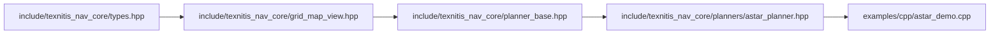

# コードリーディングガイド

> このファイルは骨格段階。実装が積み重なるたびに「初見の読者が迷子にならない順序」を更新する。

## 最初に読むべき 5 ファイル

1. `types.hpp` — `Pose2D`, `Twist2D`, `Path2D` などの POD 型と `normalizeAngle` / `clamp`
2. `grid_map_view.hpp` — 占有グリッドを zero-copy で参照するビュー型と `worldToMap` の集約点
3. `planner_base.hpp` / `controller_base.hpp` — 純粋仮想インターフェース
4. `planners/astar_planner.hpp` — 最初に読むアルゴリズム実装
5. `examples/cpp/astar_demo.cpp` — 上記を組み合わせた最小実行例

## 1 リクエストの流れ

`mbf` 経由でゴールが入ったときの全体トレース（実装が揃った後に Mermaid シーケンス図で記述する）:

1. mbf node がゴールを受信
2. `texnitis_mbf_plugins::AStarPlanner::makePlan(start, goal, ...)`
3. `MapProvider::latest()` で `OccupancyGrid` を取得 → `GridMapView` に変換（コピーなし）
4. `nav_core::AStarPlanner::planPath(map_view, start_2d, goal_2d, out_path_2d)` を呼ぶ
5. `Path2D` を `std::vector<PoseStamped>` に詰め直して mbf に返す
6. mbf が controller プラグインの `setPlan` を呼ぶ
7. 周期的に `computeVelocityCommands` → `nav_core::ControllerBase::computeCommand`
8. `isGoalReached` が true → mbf アクション完了

## 内部用語集

| 用語 | 意味 |
|---|---|
| **POD 型** | `Pose2D`, `Twist2D`, `Path2D`, `Trajectory2D` のような ROS 非依存のプレーン構造体 |
| **GridMapView** | `nav_msgs::msg::OccupancyGrid` の `data.data()` を借用するビュー。コピーしない |
| **TerrainLayersView** | elevation[m] と slope (`dz/dx`, `dz/dy`) を任意に借用するROS非依存ビュー |
| **MapProvider** | mbf プラグインが共有する /map 購読シングルトン |
| **stateful GoalChecker** | XY 到達フラグが一度立つと、後続の小さな揺らぎでは剥がれない実装 |
| **fixture** | `tests/scenarios/<id>/expected.json` に固定した正解データ |

## 「なぜ」を知りたいときは

実装の判断根拠は [design_rationale.md](design_rationale.md) を参照。
