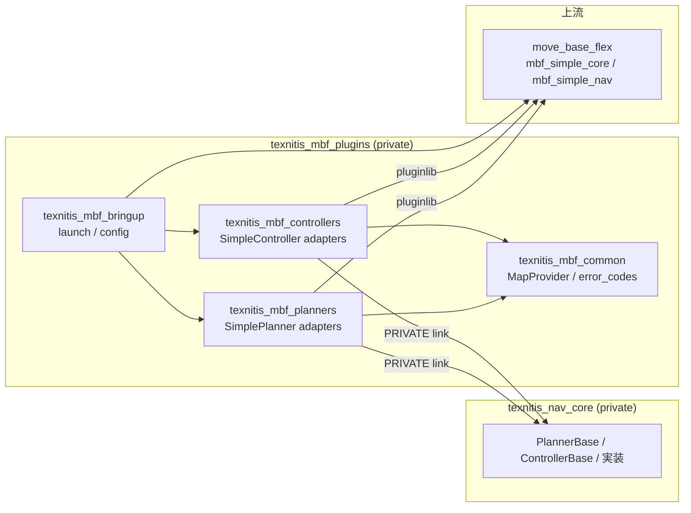

# move_base_flex 連携ガイド

`texnitis_nav_core` を ROS 2 Jazzy の
[move_base_flex (mbf)](https://github.com/naturerobots/move_base_flex)
から使うときの完全な手順とハマりどころ集です。

## 前提

| 項目 | バージョン |
|---|---|
| OS | Ubuntu 24.04（推奨）/ macOS + pixi global |
| ROS | ROS 2 Jazzy Jalisco |
| C++ | C++20 (GCC 13 / Apple Clang 15+) |
| Eigen | 3.4 以降（MPPI を使うとき） |

## アーキテクチャ俯瞰



要点:

- **`texnitis_nav_core` は ROS を一切知らない**。アダプタが ROS 型 ⇄ POD 型を変換し、
  アルゴリズム本体を呼ぶだけ。
- **`mbf_simple_core::SimplePlanner / SimpleController` を継承** したアダプタを
  `texnitis_mbf_plugins` 側で定義。pluginlib で動的にロードされる。
- **占有グリッドは `MapProvider` シングルトン** が `/map` を node 単位に 1 度だけ購読。
  複数プラグインで共有する。

## ステップバイステップ

### 1. ワークスペースを用意する

```bash
mkdir -p ~/ros2_ws/src && cd ~/ros2_ws/src
git clone https://github.com/Nyanziba/texnitis_nav_core.git
git clone https://github.com/Nyanziba/texnitis_mbf_plugins.git
```

### 2. 上流の move_base_flex を取り込む

`texnitis_mbf_plugins/third_party/move_base_flex.repos` で SHA を固定済み:

```bash
cd ~/ros2_ws
vcs import src < src/texnitis_mbf_plugins/third_party/move_base_flex.repos
```

これで `~/ros2_ws/src/move_base_flex/` ディレクトリに mbf 本体が取り込まれます。

### 3. ROS 環境を source する

- Ubuntu 24.04: `source /opt/ros/jazzy/setup.bash`
- macOS pixi: `source ~/.pixi/envs/default/setup.zsh`

### 4. 依存解決とビルド

```bash
rosdep install --from-paths src --ignore-src -r -y
colcon build --symlink-install --packages-up-to texnitis_mbf_bringup
source install/setup.bash
```

`texnitis_nav_core` は ament パッケージではないので、colcon 経由で
ビルドされる前に **CMake で個別にインストールしておく** 必要があります:

```bash
# ws の外で 1 回だけ
cmake -S src/texnitis_nav_core -B build/texnitis_nav_core \
    -DNAV_CORE_WITH_MPPI=ON \
    -DCMAKE_INSTALL_PREFIX=$PWD/install/texnitis_nav_core
cmake --build build/texnitis_nav_core -j --target install

# その後 colcon に install パスを教える
export texnitis_nav_core_DIR=$PWD/install/texnitis_nav_core/lib/cmake/texnitis_nav_core
colcon build --symlink-install --packages-up-to texnitis_mbf_bringup \
             --cmake-args -Dtexnitis_nav_core_DIR=$texnitis_nav_core_DIR
```

### 5. 起動

```bash
# 1) マップを供給する何か (line_map_publisher / map_server / シミュレータ)
ros2 run nav2_map_server map_server --ros-args -p yaml_filename:=my_map.yaml

# 2) mbf 本体 + texnitis アダプタ
ros2 launch texnitis_mbf_bringup texnitis_mbf.launch.py

# 3) ゴールを送る
ros2 run rviz2 rviz2          # 2D Goal を投げる、または
ros2 run texnitis_mbf_tools waypoint_sender.py --ros-args \
    -p waypoints_file:=waypoints.yaml
```

## YAML 設定

`texnitis_mbf_bringup/config/texnitis_mbf.yaml` をベースに編集します。

### 全体構造

```yaml
move_base_flex:
  ros__parameters:
    global_frame: map
    robot_frame: base_link
    controller_frequency: 20.0
    planner_frequency: 1.0

    planners:
      - {name: astar,    type: texnitis::mbf_planners::AStarPlanner}
      - {name: kinematic_time, type: texnitis::mbf_planners::KinematicTimeAStarPlanner}
    controllers:
      - {name: lookahead, type: texnitis::mbf_controllers::LookaheadController}
      - {name: pursuit,   type: texnitis::mbf_controllers::DiffDrivePurePursuitController}
      - {name: mppi,      type: texnitis::mbf_controllers::MecanumMppiController}

    # ↓ 各プラグインのパラメータは、planners[i].name / controllers[i].name を
    # プレフィックスにして並べる。
    astar:
      map_topic: /map
      occupied_threshold: 65
      inflation_radius: 0.30
      allow_diagonal: true

    kinematic_time:
      map_topic: /map
      terrain_topic: /terrain_grid
      missing_terrain_policy: allow_2d_only

    lookahead:
      lookahead_dist: 0.40
      max_speed_xy: 0.25
      goal_xy_tolerance: 0.05
      goal_yaw_tolerance: 0.10
      goal_stateful: true

    pursuit:
      max_linear_velocity: 0.50
      max_acceleration: 0.50
      lookahead_time: 0.80

    mppi:
      horizon: 25
      num_samples: 256
      lambda: 0.10
      sigma: [0.30, 0.30, 0.40]
      u_max: [1.50, 1.50, 1.50]
      v_max: 0.50
      omega_max: 1.50
```

### 旧 `texnitis_move_base_like.yaml` からの移行表

| 旧 yaml | 新 yaml | 備考 |
|---|---|---|
| `planner_plugin: ...AStarPlanner` | `planners` リストに `texnitis::mbf_planners::AStarPlanner` を追加 |
| `controller_plugin: ...LookaheadController` | `controllers` リストに `texnitis::mbf_controllers::LookaheadController` |
| `map_topic` | `<planner_name>.map_topic` | プラグインごとに名前空間化 |
| `cmd_vel_topic` | mbf node の remap (`/cmd_vel` 標準) |
| `goal_pose_topic` | 廃止（mbf アクションへ） |
| `external_path_topic` | `ExePath` アクションへ直接 path を投げる |
| `global_frame` | `move_base_flex.global_frame` |
| `base_frame` | `move_base_flex.robot_frame` |
| `control_hz` | `move_base_flex.controller_frequency` |
| `kp_xy` 等 controller 系 | `<controller_name>.kp_xy` |
| `goal_xy_tolerance` | `<controller_name>.goal_xy_tolerance` （加えて mbf アクション goal の `dist_tolerance` も上書きする） |

## アクション API

mbf は ROS 2 アクション 3 種類を公開します:

| アクション | 役割 | 使う場面 |
|---|---|---|
| `mbf_msgs/MoveBase` | プラン + 実行を 1 回の goal で | 通常運用 |
| `mbf_msgs/GetPath` | プランのみ | 経路だけ取得して別途確認したい |
| `mbf_msgs/ExePath` | パスを渡して実行のみ | 自前のプランナーを使いたい |

### Python から MoveBase を叩く例

```python
import rclpy
from rclpy.action import ActionClient
from rclpy.node import Node
from mbf_msgs.action import MoveBase
from geometry_msgs.msg import PoseStamped


class Sender(Node):
    def __init__(self):
        super().__init__("sender")
        self.client = ActionClient(self, MoveBase, "/move_base_flex/move_base")
        self.client.wait_for_server()
        goal = MoveBase.Goal()
        goal.target_pose = self._make_pose()
        goal.planner = "astar"
        goal.controller = "lookahead"
        self.client.send_goal_async(goal).add_done_callback(self._on_accepted)

    def _make_pose(self):
        p = PoseStamped()
        p.header.frame_id = "map"
        p.header.stamp = self.get_clock().now().to_msg()
        p.pose.position.x = 1.0
        p.pose.position.y = 0.5
        p.pose.orientation.w = 1.0
        return p

    def _on_accepted(self, future):
        future.result().get_result_async().add_done_callback(
            lambda f: self.get_logger().info(f"outcome={f.result().result.outcome}"))


rclpy.init()
rclpy.spin(Sender())
```

`texnitis_mbf_tools` パッケージの `waypoint_sender.py` がこのパターンの実用版です。

## エラーコードマッピング

mbf は `uint32_t outcome` を返します。
`texnitis_mbf_common::error_codes` で nav_core enum と双方向に対応:

| outcome | nav_core 由来 | 典型的な原因 |
|---|---|---|
| 0 SUCCESS | `Success` / `GoalReached` | OK |
| 50 NO_PATH_FOUND | `NoPathFound` | 経路探索完走したが解なし |
| 51 CANCELED | `Cancelled` | クライアントが cancel |
| 52 INVALID_START | `StartOutOfBounds` / `InvalidMap` | start がマップ外 |
| 53 INVALID_GOAL | `GoalOutOfBounds` | goal がマップ外 |
| 54 BLOCKED_START | `StartInCollision` | 開始地点が壁の中 |
| 55 BLOCKED_GOAL | `GoalInCollision` | ゴールが壁の中 |
| 59 NOT_INITIALIZED | `NotInitialized` | /map または必須Terrainが未到着 |
| 100 NO_VALID_CMD | `ComputationFailed` | controller が NaN を返した等 |
| 104 INVALID_PATH | `EmptyPath` / `PathTooFarFromRobot` | setPlan が空、path 離脱 |
| 107 CANCELED (ctrl) | `Cancelled` | controller cancel |

完全な対応表は
[`texnitis_mbf_plugins/texnitis_mbf_common/include/texnitis_mbf_common/error_codes.hpp`](https://github.com/Nyanziba/texnitis_mbf_plugins/blob/main/texnitis_mbf_common/include/texnitis_mbf_common/error_codes.hpp)。

## 自作プラグインを足す

A\* / Lookahead 以外のアルゴリズムを足したい場合:

1. **コア側** に `PlannerBase` / `ControllerBase` を継承したクラスを作り
   `texnitis_nav_core` に commit
2. **アダプタ側** に `mbf_simple_core::SimplePlanner` / `SimpleController` を継承した
   ラッパを作り `texnitis_mbf_plugins` の planners / controllers パッケージに追加
3. `plugins.xml` にエントリを足す
4. yaml の `planners` / `controllers` リストに登録

具体例は既存の
[`AStarPlanner`](https://github.com/Nyanziba/texnitis_mbf_plugins/blob/main/texnitis_mbf_planners/src/astar_planner.cpp)
が最小実装としてそのまま参考になります（`initialize` でパラメータを宣言、
`makePlan` で型変換と委譲、`cancel` で atomic flag）。

## デバッグ Tips

- **`No path found` ばかり出る**: `/map` が来ているか確認。`ros2 topic echo /map`
  で MapInfo が出るかを見る。`MapProvider` は transient_local QoS なので、
  publisher が transient_local で出していないと最初の 1 メッセージを取りこぼす。
- **`NotInitialized` で止まる**: /map、または設定上必須のTerrainGridが来ていない。
  2D fallbackを許可する場合は`<name>.missing_terrain_policy: allow_2d_only`にする。
- **`outcome=104 (INVALID_PATH)` 連発**: setPlan のあとすぐの `isGoalReached` が
  true を返している可能性。`goal_stateful: true` にしているか、`goal_xy_tolerance`
  が大きすぎないか確認。
- **`outcome=58 (TF_ERROR)`**: `global_frame` と `robot_frame` の TF が来ていない。
  `ros2 run tf2_ros tf2_echo map base_link` で確認。
- **rviz2 でパスが描画されない**: planner の debug topic は `/<name>/plan` 等で
  出ます。`/move_base_flex/get_path/feedback` の `path` フィールドからも取得可。

## 関連リポジトリ

- [`Nyanziba/texnitis_nav_core`](https://github.com/Nyanziba/texnitis_nav_core)
  — このリポ。コアアルゴリズム
- [`Nyanziba/texnitis_mbf_plugins`](https://github.com/Nyanziba/texnitis_mbf_plugins)
  — mbf 用 SimplePlanner / SimpleController アダプタ + bringup + tools + WebUI
- [`naturerobots/move_base_flex`](https://github.com/naturerobots/move_base_flex)
  — 上流の mbf 本体（ros2 ブランチ）
